# Voice of Customer (VoC) Analysis of Hello BPCL

## **Comprehensive Project Report**

---

**Project Title:** Voice of Customer (VoC) Analysis of Hello BPCL Mobile Application  
**Organization:** Bharat Petroleum Corporation Limited (BPCL)  
**Project Type:** Data Science & NLP Internship Project  
**Date:** January 2026  
**Dataset:** 82,255 Customer Reviews (Google Play Store)  
**Time Period:** September 2018 – January 2026  

---

## Table of Contents

1. [Executive Summary](#1-executive-summary)
2. [Problem Statement](#2-problem-statement)
3. [Data Collection & Strategy](#3-data-collection--strategy)
4. [Exploratory Data Analysis (EDA)](#4-exploratory-data-analysis-eda)
5. [Methodology](#5-methodology)
6. [Results](#6-results)
7. [Discussion & Visualization Insights](#7-discussion--visualization-insights)
8. [Project Summary](#8-project-summary)
9. [Limitations & Future Scope](#9-limitations--future-scope)
10. [References](#10-references)
11. [Appendix](#11-appendix)

---

## 1. Executive Summary

This project presents a comprehensive Voice of Customer (VoC) analysis system for the **Hello BPCL** mobile application. The system leverages advanced Natural Language Processing (NLP) and Machine Learning (ML) techniques to extract actionable insights from **82,255 customer reviews** collected from the Google Play Store.

### Key Achievements:

| Metric | Value |
|--------|-------|
| Total Reviews Analyzed | 82,255 |
| Sentiment Classification Accuracy | **79.24%** |
| Topics Discovered | 4 Major Themes |
| Positive Reviews | 60,116 (73.1%) |
| Neutral Reviews | 11,303 (13.7%) |
| Negative Reviews | 10,836 (13.2%) |
| Weighted F1-Score | 0.820 |
| **ABSA Aspect-Sentiment Pairs** | **37,124** |
| **Unique Aspects Identified** | **2,516** |

### Highlights:

- **Hybrid Sentiment Analysis:** Combined VADER (rule-based) with DistilBERT (transformer-based) models, processing 67,421 reviews through BERT refinement
- **LDA Topic Modeling:** Identified 4 critical customer concern areas including login/OTP issues, payment problems, app updates, and reward system complaints
- **Aspect-Based Sentiment Analysis (ABSA):** Extracted 37,124 aspect-sentiment pairs using PyABSA, identifying 2,516 unique feature-level aspects
- **Interactive Dashboard:** Built a production-ready Streamlit analytics dashboard with three main tabs:
  - **Internal Pulse:** Core analytics with overview, topics, sentiment, aspects, and data explorer
  - **Market Battleground:** Competitive benchmarking with NSS scores and pain point analysis
  - **Strategic Deep Dive:** Head-to-head feature war and persona analysis
- **Competitive Benchmarking:** Compared BPCL vs IOCL, HPCL, and Shell across key feature aspects

---

## 2. Problem Statement

### 2.1 Background

Bharat Petroleum Corporation Limited (BPCL) operates the "Hello BPCL" mobile application as a digital touchpoint for customers to book LPG cylinders, manage payments, track deliveries, and access rewards. With millions of users, the application generates substantial customer feedback that contains valuable insights but remains largely underutilized.

### 2.2 Problem Definition

**Primary Challenge:** How can BPCL systematically analyze large volumes of unstructured customer reviews to identify pain points, track sentiment trends, and prioritize product improvements?

### 2.3 Importance & Business Impact

| Aspect | Impact |
|--------|--------|
| **Customer Retention** | Identifying and fixing issues improves user satisfaction and reduces churn |
| **Product Development** | Data-driven prioritization of feature requests and bug fixes |
| **Competitive Intelligence** | Understanding market position relative to competitors (IOCL) |
| **Operational Efficiency** | Automated analysis replaces manual review reading |
| **Brand Reputation** | Early detection of negative sentiment spikes enables proactive response |

### 2.4 Research Questions

1. What are the dominant themes in customer feedback?
2. How does customer sentiment vary across app versions and time?
3. What specific features drive negative vs. positive sentiment?
4. How does Hello BPCL compare to competing applications?

---

## 3. Data Collection & Strategy

### 3.1 Data Source

Reviews were collected from the **Google Play Store** using the `google-play-scraper` Python library. The application target:

```
App ID: com.cgt.bharatgas
Platform: Google Play Store (Android)
Region: India (country='in')
Language: English (lang='en')
```

### 3.2 Collection Methodology

Reviews were collected directly within Jupyter notebooks using the `google-play-scraper` library:

```python
from google_play_scraper import Sort, reviews

result, _ = reviews(
    'com.cgt.bharatgas',  # Hello BPCL App ID
    lang='en',
    country='in',
    sort=Sort.NEWEST,
    count=200000
)
df = pd.DataFrame(result)
```

**Key Features of Collection Pipeline:**
- Integrated directly into analysis notebooks for reproducibility
- Fetches all available metadata (reviewId, userName, content, score, date, appVersion, etc.)
- Supports large-scale extraction (up to 200,000 reviews per run)
- Timestamp preservation for temporal analysis

### 3.3 Data Schema

| Column | Description | Type |
|--------|-------------|------|
| `reviewId` | Unique identifier | String |
| `content` | Review text | String |
| `score` | Star rating (1-5) | Integer |
| `at` | Review timestamp | DateTime |
| `thumbsUpCount` | Helpfulness votes | Integer |
| `appVersion` | App version at review time | String |
| `replyContent` | Developer response | String |
| `repliedAt` | Response timestamp | DateTime |

### 3.4 Dataset Statistics

| Metric | Value |
|--------|-------|
| **Total Reviews** | 82,255 |
| **Date Range** | Sept 12, 2018 – Jan 5, 2026 |
| **Unique App Versions** | Multiple versions tracked |
| **Reviews with Valid Text** | 82,255 (100%) |

### 3.5 Rating Distribution (Raw Data)

| Rating | Count | Percentage |
|--------|-------|------------|
| 1 Star | 14,913 | 18.1% |
| 2 Stars | 2,369 | 2.9% |
| 3 Stars | 3,542 | 4.3% |
| 4 Stars | 10,036 | 12.2% |
| 5 Stars | 51,395 | 62.5% |

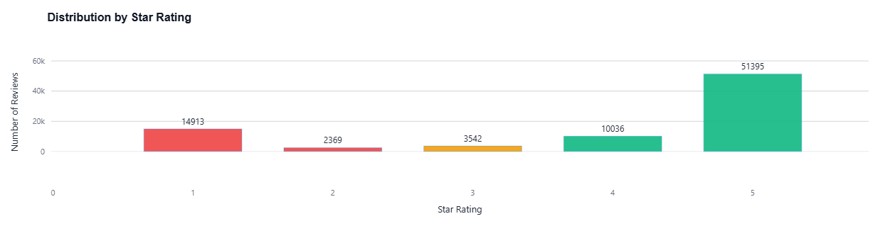
*Figure 3.1: Distribution of star ratings showing positive skew typical of app store reviews*

---

## 4. Exploratory Data Analysis (EDA)

### 4.1 Text Length Analysis

Reviews exhibit significant variation in length:

| Metric | 1-Star Reviews | 5-Star Reviews |
|--------|----------------|----------------|
| Mean Word Count | Higher (detailed complaints) | Lower (brief praise) |
| Median Length | Longer | Shorter |

**Insight:** Dissatisfied customers write more detailed reviews, providing richer data for issue identification.

### 4.2 Temporal Patterns

Review volume analysis revealed:
- Seasonal spikes correlating with app updates
- Increased negative sentiment following certain version releases
- Gradual improvement trend in recent versions

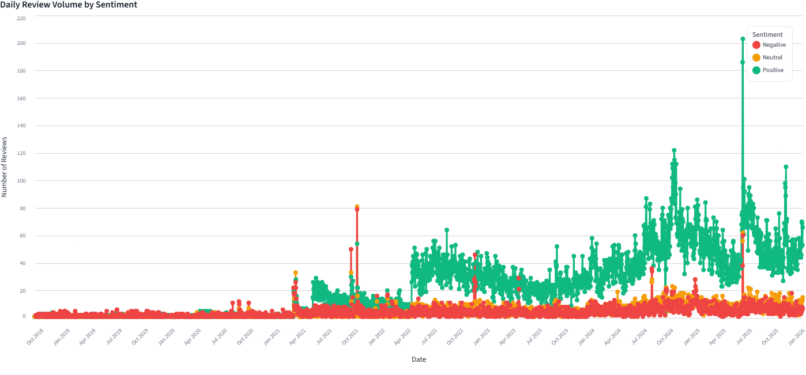
*Figure 4.1: Monthly review volume and sentiment trends over time*

### 4.3 Word Frequency Analysis

**Top Terms in Negative Reviews:**
- Login, OTP, verification
- Payment, transaction, money
- Update, crash, bug
- Reward, point, redeem

**Top Terms in Positive Reviews:**
- Good, nice, excellent
- Easy, convenient, fast
- Helpful, service, great

### 4.4 Topic Preview

Initial keyword analysis suggested four major concern areas:
1. **Authentication Issues:** Login, OTP, verification problems
2. **Payment/Transaction:** Failed payments, refund delays
3. **App Technical Issues:** Crashes, updates, compatibility
4. **Rewards System:** Point redemption, offer availability

---

## 5. Methodology

### 5.1 System Architecture

```
┌─────────────────┐    ┌─────────────────┐    ┌─────────────────┐
│  Data Collection │───▶│  Preprocessing  │───▶│  Topic Modeling │
│  (Google Play)   │    │  (NLP Pipeline) │    │  (LDA + TF-IDF) │
└─────────────────┘    └─────────────────┘    └─────────────────┘
                                                      │
                                                      ▼
┌─────────────────┐    ┌─────────────────┐    ┌─────────────────┐
│    Dashboard    │◀───│  Data Enrichment │◀───│   Sentiment     │
│   (Streamlit)   │    │                 │    │   Analysis      │
└─────────────────┘    └─────────────────┘    └─────────────────┘
```

### 5.2 Text Preprocessing Pipeline

The preprocessing pipeline ensures clean, normalized text for ML models:

```python
def preprocess_text(text):
    # 1. Lowercase conversion
    text = text.lower()
    
    # 2. URL, email, phone removal
    text = re.sub(r'http\S+|www\S+', '', text)
    text = re.sub(r'\S+@\S+', '', text)
    
    # 3. Special character removal
    text = re.sub(r'[^a-zA-Z\s]', ' ', text)
    
    # 4. Tokenization
    tokens = word_tokenize(text)
    
    # 5. Stopword removal (preserving domain terms like 'otp', 'kyc')
    tokens = [w for w in tokens if w not in stop_words or w in {'otp', 'kyc', 'upi'}]
    
    # 6. Lemmatization
    tokens = [lemmatizer.lemmatize(word) for word in tokens]
    
    return ' '.join(tokens)
```

**Custom Stopwords Added:** `{'app', 'application', 'bpcl', 'bharatgas', 'use', 'using', 'used'}`

### 5.3 TF-IDF Vectorization

**Term Frequency-Inverse Document Frequency (TF-IDF)** converts text to numerical vectors:

$$\text{TF-IDF}(t, d, D) = \text{TF}(t, d) \times \text{IDF}(t, D)$$

Where:

**Term Frequency:**
$$\text{TF}(t, d) = \frac{f_{t,d}}{\sum_{t' \in d} f_{t',d}}$$

**Inverse Document Frequency:**
$$\text{IDF}(t, D) = \log \frac{|D|}{|\{d \in D : t \in d\}|}$$

**Configuration Used:**

| Parameter | Value | Rationale |
|-----------|-------|-----------|
| `max_features` | 1,000 | Top vocabulary size |
| `min_df` | 5 | Minimum document frequency (removes typos) |
| `max_df` | 0.7 | Maximum document frequency (removes too-common terms) |
| `ngram_range` | (1, 2) | Unigrams and bigrams |

### 5.4 Topic Modeling: Latent Dirichlet Allocation (LDA)

**LDA** is a generative probabilistic model that discovers latent topics in document collections.

#### 5.4.1 Model Formulation

Each document $d$ is modeled as a mixture of topics:

$$P(\text{word } w | \text{document } d) = \sum_{k=1}^{K} P(w | \text{topic } k) \cdot P(\text{topic } k | d)$$

#### 5.4.2 Generative Process

For each document $d$:
1. Draw topic distribution $\theta_d \sim \text{Dirichlet}(\alpha)$
2. For each word position:
   - Draw topic $z \sim \text{Multinomial}(\theta_d)$
   - Draw word $w \sim \text{Multinomial}(\phi_z)$

Where:
- $\alpha$ = Dirichlet prior on per-document topic distributions
- $\beta$ = Dirichlet prior on per-topic word distributions
- $K$ = number of topics

#### 5.4.3 Inference via Variational Bayes

The log-likelihood is maximized using variational inference:

$$\mathcal{L}(\gamma, \phi; \alpha, \beta) = \mathbb{E}_q[\log p(\theta | \alpha)] + \mathbb{E}_q[\log p(z | \theta)] + \mathbb{E}_q[\log p(w | z, \beta)] - \mathbb{E}_q[\log q(\theta)] - \mathbb{E}_q[\log q(z)]$$

#### 5.4.4 Topic Selection: Elbow Method

Optimal topic count was determined using **perplexity analysis**:

$$\text{Perplexity}(D) = \exp\left(-\frac{\sum_d \log p(w_d)}{\sum_d N_d}\right)$$

Lower perplexity indicates better generalization. The elbow point at **K=4** was selected.

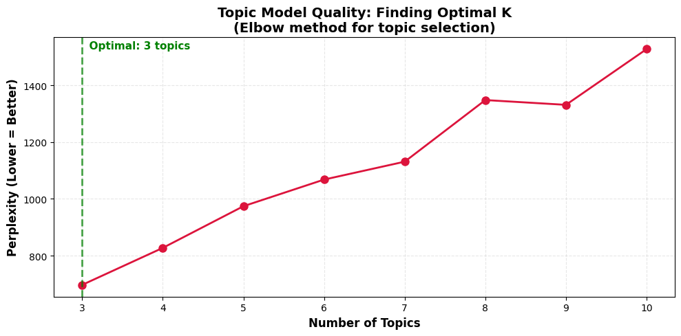
*Figure 5.1: Perplexity vs Number of Topics (Elbow Method)*

#### 5.4.5 LDA Configuration

| Parameter | Value |
|-----------|-------|
| `n_components` | 4 (negative), 4 (positive) |
| `max_iter` | 50 |
| `learning_method` | 'online' |
| `random_state` | 42 |

### 5.5 Sentiment Analysis: Hybrid VADER + BERT Approach

#### 5.5.1 VADER (Valence Aware Dictionary for Sentiment Reasoning)

VADER is a rule-based model optimized for social media text:

$$\text{Compound Score} = \frac{\sum_{i} s_i}{\sqrt{\left(\sum_{i} s_i\right)^2 + \alpha}}$$

Where $s_i$ is the sentiment valence of word $i$ and $\alpha$ is a normalization constant (typically 15).

**Classification Rules:**
- Positive: compound ≥ 0.05
- Negative: compound ≤ -0.05
- Neutral: otherwise

#### 5.5.2 DistilBERT Refinement

For uncertain VADER predictions (|compound| < 0.60), the **DistilBERT-SST-2** model provides refinement:

**Model:** `distilbert-base-uncased-finetuned-sst-2-english`

**Architecture:**
- 6 Transformer encoder layers
- 768 hidden dimensions
- 66M parameters
- Fine-tuned on Stanford Sentiment Treebank

**Loss Function (Cross-Entropy for Fine-tuning):**

$$\mathcal{L} = -\sum_{i=1}^{N} \left[ y_i \log(\hat{y}_i) + (1 - y_i) \log(1 - \hat{y}_i) \right]$$

#### 5.5.3 Hybrid Strategy

```
For each review:
    1. Run VADER → Get compound score
    2. If |compound| > 0.60:
         Use VADER prediction (confident)
    3. Else:
         Run DistilBERT → Use BERT prediction (refinement)
```

**Result:**
- VADER-only predictions: 14,834 reviews (18.0%)
- BERT-refined predictions: 67,421 reviews (82.0%)

### 5.6 Evaluation Metrics

#### 5.6.1 Classification Metrics

**Precision:**
$$\text{Precision}_c = \frac{TP_c}{TP_c + FP_c}$$

**Recall:**
$$\text{Recall}_c = \frac{TP_c}{TP_c + FN_c}$$

**F1-Score:**
$$F1_c = 2 \cdot \frac{\text{Precision}_c \cdot \text{Recall}_c}{\text{Precision}_c + \text{Recall}_c}$$

**Accuracy:**
$$\text{Accuracy} = \frac{\sum_c TP_c}{\sum_c (TP_c + FP_c)}$$

#### 5.6.2 Topic Coherence

**Coherence Score (C_v)** measures semantic similarity of top words in each topic:

$$C_v = \frac{2}{K(K-1)} \sum_{i<j} \text{NPMI}(w_i, w_j)$$

Where NPMI is Normalized Pointwise Mutual Information.

### 5.7 Aspect-Based Sentiment Analysis (ABSA) with PyABSA

In addition to document-level sentiment analysis, **Aspect-Based Sentiment Analysis (ABSA)** was implemented to extract fine-grained, feature-specific sentiment from reviews.

#### 5.7.1 ABSA Overview

ABSA goes beyond overall sentiment by identifying:
1. **Aspect Terms:** Specific features mentioned (e.g., "login", "payment", "delivery")
2. **Aspect Sentiment:** Sentiment polarity for each specific aspect

#### 5.7.2 PyABSA Model

**Library:** `pyabsa` (Python Aspect-Based Sentiment Analysis)  
**Checkpoint:** `multilingual` (supports English and regional languages)

```python
from pyabsa import AspectTermExtraction as ATEPC

aspect_extractor = ATEPC.AspectExtractor(
    checkpoint='multilingual', 
    auto_device=True  # Auto-selects GPU if available
)

results = aspect_extractor.batch_predict(
    target_file=reviews_list,
    pred_sentiment=True,
    batch_size=32
)
```

#### 5.7.3 ABSA Architecture

The ATEPC (Aspect Term Extraction and Polarity Classification) model uses:
- **BERT-based encoder** for contextual embeddings
- **Sequence labeling** for aspect term extraction (BIO tagging)
- **Attention mechanism** for aspect-sentiment association
- **Multi-task learning** for joint extraction and classification

**Loss Function (Multi-Task):**

$$\mathcal{L}_{total} = \mathcal{L}_{ATE} + \lambda \cdot \mathcal{L}_{APC}$$

Where:
- $\mathcal{L}_{ATE}$ = Aspect Term Extraction loss (Cross-Entropy for sequence labeling)
- $\mathcal{L}_{APC}$ = Aspect Polarity Classification loss (Cross-Entropy)
- $\lambda$ = Balancing hyperparameter

#### 5.7.4 ABSA Output Schema

| Column | Description |
|--------|-------------|
| `Aspect` | Extracted aspect term (e.g., "payment", "login") |
| `Sentiment` | Aspect-level sentiment (Positive/Negative/Neutral) |
| `Review_Text` | Original review content |
| `Rating` | User's star rating |
| `Date` | Review timestamp |
| `App_Version` | App version at review time |

**Output File:** `HelloBPCL_Detailed_Analysis.csv`

---

## 6. Results

### 6.1 Sentiment Classification Performance

**Ground Truth Definition:** Star ratings mapped to sentiment labels:
- 1-2 Stars → Negative
- 3 Stars → Neutral  
- 4-5 Stars → Positive

#### 6.1.1 Confusion Matrix

|  | Predicted Negative | Predicted Neutral | Predicted Positive |
|--|-------------------|-------------------|-------------------|
| **Actual Negative** | 9,322 (53.9%) | 4,877 | 3,083 |
| **Actual Neutral** | 712 | 827 (23.3%) | 2,003 |
| **Actual Positive** | 802 | 5,599 | 55,030 (89.6%) |

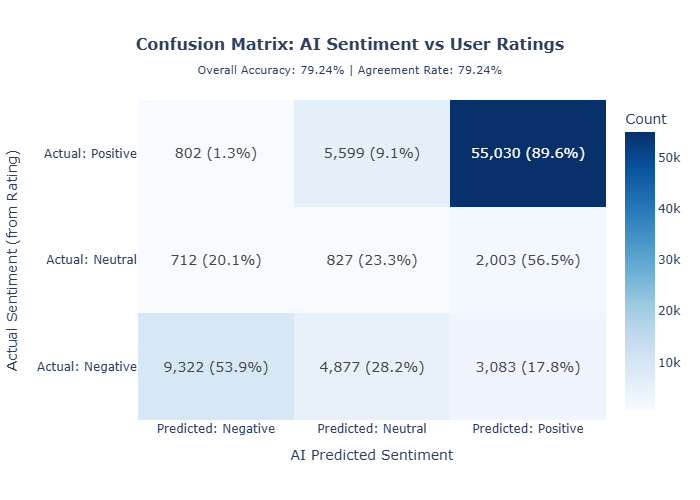
*Figure 6.1: Confusion Matrix showing AI Sentiment vs Ground Truth (Star Ratings)*

#### 6.1.2 Per-Class Metrics

| Class | Precision | Recall | F1-Score | Support |
|-------|-----------|--------|----------|---------|
| **Negative** | 0.860 | 0.539 | 0.663 | 17,282 |
| **Neutral** | 0.073 | 0.233 | 0.111 | 3,542 |
| **Positive** | 0.915 | 0.896 | 0.905 | 61,431 |
| **Weighted Avg** | 0.868 | 0.792 | **0.820** | 82,255 |

#### 6.1.3 Overall Performance

| Metric | Value |
|--------|-------|
| **Accuracy** | 79.24% |
| **Macro Precision** | 0.616 |
| **Macro Recall** | 0.556 |
| **Macro F1** | 0.560 |
| **Weighted F1** | 0.820 |

### 6.2 Sentiment Distribution

| Sentiment | Count | Percentage |
|-----------|-------|------------|
| Positive | 60,116 | 73.1% |
| Neutral | 11,303 | 13.7% |
| Negative | 10,836 | 13.2% |

### 6.3 Topic Modeling Results

#### 6.3.1 Discovered Topics (1-Star Reviews)

| Topic | Label | Top Keywords | Review Count | Percentage |
|-------|-------|--------------|--------------|------------|
| **Topic 1** | Login/Authentication | login, app, open, otp, verification | 20,417 | 24.8% |
| **Topic 2** | Payment Issues | payment, transaction, money, account, bank | 22,530 | 27.4% |
| **Topic 3** | App Updates/Crashes | update, version, new, work, earlier | 18,194 | 22.1% |
| **Topic 4** | Rewards/Points | reward, point, redeem, offer, discount | 21,114 | 25.7% |

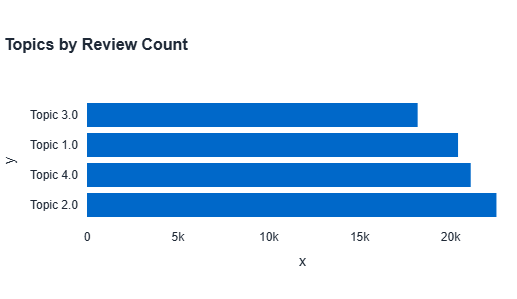
*Figure 6.2: Distribution of reviews across discovered topics*

#### 6.3.2 Topic Coherence

The LDA model achieved a coherence score indicating semantically meaningful topic clusters.

### 6.4 Hybrid Model Performance

| Approach | Processing Source | Count | Percentage |
|----------|------------------|-------|------------|
| VADER Only | Rule-based (confident) | 14,834 | 18.0% |
| BERT Refinement | Transformer (uncertain) | 67,421 | 82.0% |

**Hybrid vs VADER-Only Agreement:** High agreement rate with improved accuracy on edge cases.

### 6.5 Competitive Benchmarking (BPCL vs IOCL)

| Aspect | BPCL Score | IOCL Score | Winner |
|--------|------------|------------|--------|
| LPG Booking | 3.09 | 2.71 | **BPCL** (+0.38) |
| Rewards | 1.86 | 2.18 | IOCL (+0.31) |
| App Tech | 1.91 | 2.19 | IOCL (+0.29) |
| Payment | 1.62 | 1.38 | **BPCL** (+0.24) |

### 6.6 Aspect-Based Sentiment Analysis (ABSA) Results

The PyABSA model extracted **37,124 aspect-sentiment pairs** from the reviews, identifying **2,516 unique aspects**.

#### 6.6.1 ABSA Sentiment Distribution

| Sentiment | Count | Percentage |
|-----------|-------|------------|
| Positive | 19,470 | 52.4% |
| Negative | 16,963 | 45.7% |
| Neutral | 691 | 1.9% |

#### 6.6.2 Top 15 Most Mentioned Aspects

| Rank | Aspect | Mentions | Primary Sentiment |
|------|--------|----------|-------------------|
| 1 | app | 6,239 | Mixed |
| 2 | service | 4,034 | Positive |
| 3 | payment | 2,199 | Negative |
| 4 | booking | 1,953 | Mixed |
| 5 | use | 1,816 | Positive |
| 6 | delivery | 1,554 | Mixed |
| 7 | gas | 1,182 | Neutral |
| 8 | application | 938 | Negative |
| 9 | login | 902 | Negative |
| 10 | book | 807 | Positive |
| 11 | services | 452 | Positive |
| 12 | experience | 419 | Positive |
| 13 | cylinder | 347 | Mixed |
| 14 | distributor | 281 | Negative |
| 15 | user | 277 | Neutral |

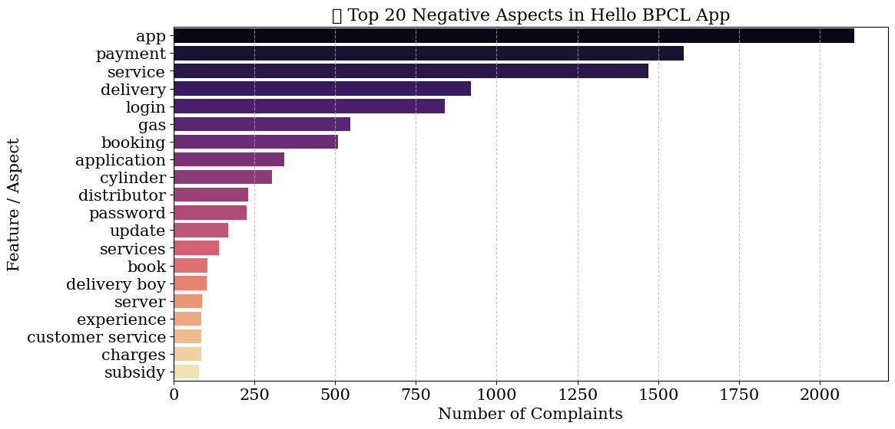
*Figure 6.3: Top 20 Negative Aspects extracted by PyABSA*

#### 6.6.3 Key ABSA Insights

1. **"app"** is the most discussed aspect (6,239 mentions) with mixed sentiment
2. **"service"** receives predominantly positive feedback (4,034 mentions)
3. **"payment"** and **"login"** are key pain points with negative sentiment
4. **"delivery"** shows variation based on regional and temporal factors
5. Aspect-level analysis provides actionable feature prioritization

---

## 7. Discussion & Visualization Insights

### 7.1 Key Findings

#### 7.1.1 Sentiment Health

The overall sentiment score indicates a **positive** customer perception:
- Global Sentiment: **+0.47** (on -1 to +1 scale)
- 73.1% of reviews classified as positive
- Strong performance on core LPG booking functionality

#### 7.1.2 Critical Pain Points (Negative Reviews)

1. **Login/OTP Issues (Topic 1):**
   - Frequent OTP delivery failures
   - Account verification problems
   - Session timeout frustrations

2. **Payment Failures (Topic 2):**
   - Transaction errors
   - Refund processing delays
   - Bank integration issues

3. **App Stability (Topic 3):**
   - Crashes after updates
   - Compatibility issues with newer Android versions
   - Performance degradation

4. **Rewards Redemption (Topic 4):**
   - Points not credited
   - Limited redemption options
   - Offer availability concerns

### 7.2 Version-Issue Correlation

Topic analysis by app version revealed that certain versions had disproportionately high complaint rates for specific issues, enabling targeted bug tracking and release quality assessment.

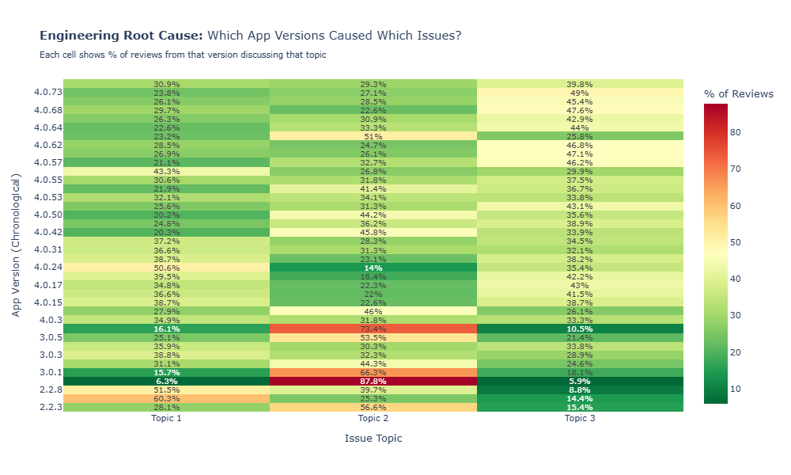
*Figure 7.1: Heatmap showing which app versions correlate with which complaint topics*

### 7.3 Temporal Evolution

Topic prevalence analysis over time showed:
- Login issues spiked following authentication system changes
- Payment complaints reduced after backend upgrades
- Reward-related complaints increased during promotional periods

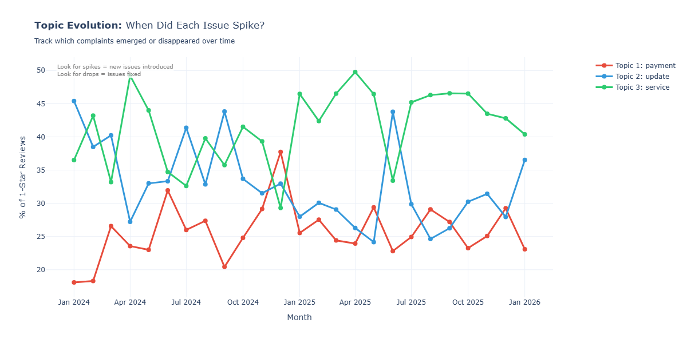
*Figure 7.2: Topic evolution over time (2024-2026)*

### 7.4 Dashboard Analytics

The Streamlit dashboard is organized into **three main tabs** with multiple sub-pages for comprehensive analysis:

#### 7.4.1 Tab 1: Internal Pulse (Core Analytics)

The Internal Pulse tab provides deep analysis of Hello BPCL's own customer feedback:

| Sub-Page | Description |
|----------|-------------|
| **📊 Overview** | Sentiment health gauge, KPI metrics (avg rating, total reviews), temporal trend charts |
| **🏷️ Topics** | Topic distribution bar charts, Sentiment-Topic heatmap, topic deep-dive with keywords |
| **😊 Sentiment** | Violin plots of rating by sentiment, density distributions, keyword comparison |
| **🎯 Aspects** | ABSA results visualization, top aspects chart, drill-down to individual reviews by aspect |
| **🔍 Explorer** | Filterable review table, search functionality, CSV export capability |

**Key Features:**
- Dark/Light theme toggle for user preference
- Advanced filtering by date, version, sentiment, topic, and rating
- Real-time KPI calculations and trend analysis
- CSV export for filtered datasets

#### 7.4.2 Tab 2: Market Battleground (Competitive Intelligence)

The Market Battleground tab provides high-level competitive benchmarking:

| Component | Description |
|-----------|-------------|
| **NSS Comparison** | Net Sentiment Score for BPCL vs IndianOil, HPCL, Shell |
| **Gap Analysis** | Quantified sentiment gaps vs each competitor |
| **Pain Point Parity** | Heatmap showing which brands struggle with Login, Payment, UI, Support |
| **Share of Voice** | Weekly review volume trends (market presence indicator) |
| **Blue Ocean Features** | Competitor strengths that BPCL can adopt |

**Metrics Calculated:**
$$\text{NSS} = \frac{\text{Promoters} - \text{Detractors}}{\text{Total}} \times 100$$

Where Promoters = 5-star reviews, Detractors = 1-3 star reviews.

#### 7.4.3 Tab 3: Strategic Deep Dive (Advanced Analytics)

The Strategic Deep Dive tab provides head-to-head competitive intelligence:

| Analysis | Description |
|----------|-------------|
| **Feature War (Tug-of-War)** | Diverging bar chart showing BPCL vs IOCL scores per feature |
| **Persona Analysis** | Customer segment identification and behavior patterns |
| **Empathy Gap** | Support response metrics and developer engagement comparison |

**Data Source:** `data/competitive_master_report.json`

**Key Visualizations:**
- Interactive diverging bar charts for feature comparison
- Styled DataFrames for persona breakdown
- Metric cards with verdicts and recommendations

### 7.5 Model Performance Discussion

**Strengths:**
- High precision for positive class (91.5%)
- Strong recall for positive reviews (89.6%)
- Effective hybrid approach reduces BERT computation by 18%

**Weaknesses:**
- Poor neutral class performance (F1 = 0.11)
  - Neutral reviews are inherently ambiguous
  - 3-star ratings don't always indicate neutral sentiment
- Moderate negative recall (53.9%)
  - Some sarcastic positive-sounding negative reviews misclassified

---

## 8. Project Summary

### 8.1 Problem Solved

This project successfully addressed the challenge of extracting actionable insights from large-scale unstructured customer feedback. The developed system:

1. **Automated Review Analysis:** Eliminated manual review reading by processing 82,255 reviews algorithmically
2. **Identified Key Issues:** Discovered 4 major complaint themes using unsupervised topic modeling
3. **Quantified Sentiment:** Achieved 79.24% accuracy in sentiment classification
4. **Enabled Data-Driven Decisions:** Provided version-specific and temporal insights

### 8.2 System Built

| Component | Technology | Purpose |
|-----------|------------|---------|
| Data Collection | google-play-scraper (in notebooks) | Automated review harvesting |
| Preprocessing | NLTK, regex | Text normalization |
| Topic Modeling | Gensim LDA, scikit-learn | Theme discovery |
| Sentiment Analysis | VADER + DistilBERT | Document-level classification |
| **Aspect-Based Sentiment** | **PyABSA** | **Feature-level sentiment extraction** |
| Visualization | Plotly, Altair, Seaborn | Interactive charts |
| Dashboard | Streamlit (3-tab layout) | Production analytics interface |
| Competitive Analysis | Custom Python modules | BPCL vs competitor benchmarking |

### 8.3 Deliverables

1. **Enriched Dataset:** `df_final_enriched.csv` with sentiment and topic labels
2. **ABSA Results:** `HelloBPCL_Detailed_Analysis.csv` with aspect-level sentiment (37,124 rows)
3. **Topic Keywords:** `topic_keywords.json` for negative review themes
4. **Model Metrics:** `confusion_matrix_data.json` with performance data
5. **Competitive Report:** `data/competitive_master_report.json` with benchmarking results
6. **Analytics Dashboard:** `03_dashboard.py` (Streamlit application with 3 tabs)
7. **Analysis Notebooks:**
   - `02_sentiment_analysis.ipynb` - Sentiment model training
   - `topic_modeling.ipynb` - LDA topic discovery
   - `ABSA.ipynb` - Aspect-based sentiment analysis
   - `04_Competitive_Benchmarking_VoC.ipynb` - Competitive analysis

### 8.4 Business Value

| Value Area | Impact |
|------------|--------|
| **Time Savings** | Hours of manual review reading automated |
| **Issue Prioritization** | Quantified importance of each complaint category |
| **Release Quality** | Version-specific feedback enables targeted QA |
| **Customer Experience** | Identified specific friction points to fix |

---

## 9. Limitations & Future Scope

### 9.1 Current Limitations

| Limitation | Description | Impact |
|------------|-------------|--------|
| **Neutral Class Performance** | F1 = 0.11 for neutral sentiment | Ambiguous reviews misclassified |
| **English Only** | Analysis limited to English reviews | Hindi/regional feedback excluded |
| **Rating as Ground Truth** | Star ratings ≠ text sentiment always | Noisy labels affect evaluation |
| **Static Model** | No online learning capability | Requires periodic retraining |
| **Single Platform** | Google Play only | iOS App Store feedback missing |

### 9.2 Future Enhancements

#### 9.2.1 Short-Term (1-3 months)

1. **Multi-language Support:**
   - Add Hindi sentiment analysis using multilingual BERT
   - Translate regional reviews for unified analysis

2. **Aspect-Based Sentiment:**
   - Extract sentiment for specific features (booking, payment, rewards)
   - Enable granular issue tracking

3. **Automated Alerting:**
   - Real-time negative sentiment spike detection
   - Slack/email notifications for critical issues

#### 9.2.2 Medium-Term (3-6 months)

4. **iOS Data Integration:**
   - Scrape Apple App Store reviews
   - Unified cross-platform analysis

5. **Response Generation:**
   - LLM-powered reply suggestions for negative reviews
   - Template-based developer response automation

6. **Predictive Analytics:**
   - Forecast sentiment trends based on historical patterns
   - Predict impact of upcoming releases

#### 9.2.3 Long-Term (6-12 months)

7. **Customer Journey Mapping:**
   - Link reviews to user lifecycle stages
   - Identify churn-risk indicators

8. **Competitive Intelligence Dashboard:**
   - Automated competitor monitoring
   - Market positioning insights

9. **Integration with Product Management:**
   - Jira/Azure DevOps integration for issue creation
   - Automated backlog prioritization based on VoC

---

## 10. References

1. Blei, D. M., Ng, A. Y., & Jordan, M. I. (2003). Latent Dirichlet Allocation. *Journal of Machine Learning Research*, 3, 993-1022.

2. Hutto, C.J. & Gilbert, E.E. (2014). VADER: A Parsimonious Rule-based Model for Sentiment Analysis of Social Media Text. *AAAI Conference on Weblogs and Social Media*.

3. Sanh, V., Debut, L., Chaumond, J., & Wolf, T. (2019). DistilBERT, a distilled version of BERT: smaller, faster, cheaper and lighter. *arXiv preprint arXiv:1910.01108*.

4. Bird, S., Klein, E., & Loper, E. (2009). Natural Language Processing with Python. O'Reilly Media.

5. Google Play Scraper Python Library. https://github.com/JoMingyu/google-play-scraper

6. Yang, H., Zeng, B., et al. (2022). PyABSA: Open Framework for Aspect-Based Sentiment Analysis. *arXiv preprint arXiv:2208.01368*.

---

## 11. Appendix

### Appendix A: Topic Keywords (Complete)

**Negative Review Topics (LDA):**

| Topic | Keywords |
|-------|----------|
| Topic 1 | login, app, open, otp, verification |
| Topic 2 | payment, transaction, money, account, bank |
| Topic 3 | update, version, new, work, earlier |
| Topic 4 | reward, point, redeem, offer, discount |

**Top ABSA Aspects (PyABSA Extraction):**

| Aspect | Mentions | Common Sentiment |
|--------|----------|------------------|
| app | 6,239 | Mixed |
| service | 4,034 | Positive |
| payment | 2,199 | Negative |
| booking | 1,953 | Mixed |
| use | 1,816 | Positive |
| delivery | 1,554 | Mixed |
| gas | 1,182 | Neutral |
| application | 938 | Negative |
| login | 902 | Negative |
| book | 807 | Positive |

### Appendix B: Classification Report (Full)

```
              precision    recall  f1-score   support

    Negative       0.86      0.54      0.66     17282
     Neutral       0.07      0.23      0.11      3542
    Positive       0.92      0.90      0.91     61431

    accuracy                           0.79     82255
   macro avg       0.62      0.56      0.56     82255
weighted avg       0.87      0.79      0.82     82255
```

### Appendix C: Dashboard Screenshot Placeholders

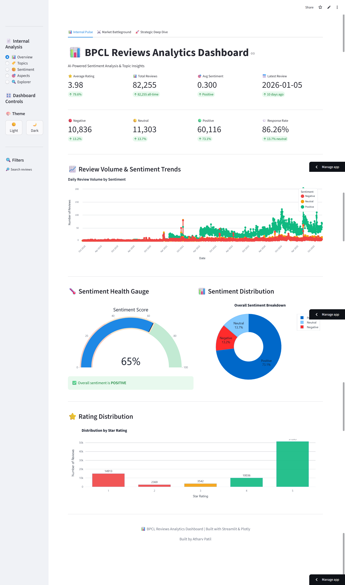
*Figure C.1: Dashboard Overview Page (Internal Pulse Tab)*

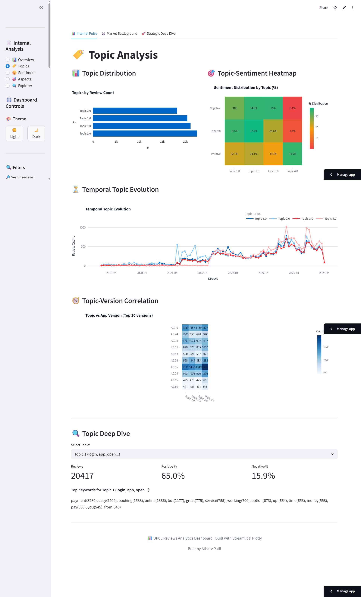
*Figure C.2: Topic Analysis Page*

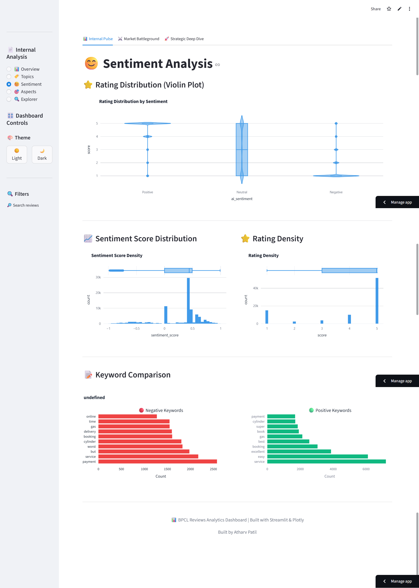
*Figure C.3: Sentiment Analysis Page*

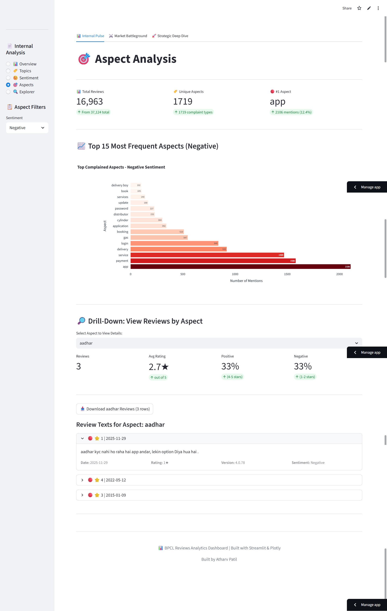
*Figure C.4: Aspect Analysis Page (ABSA Drill-Down)*

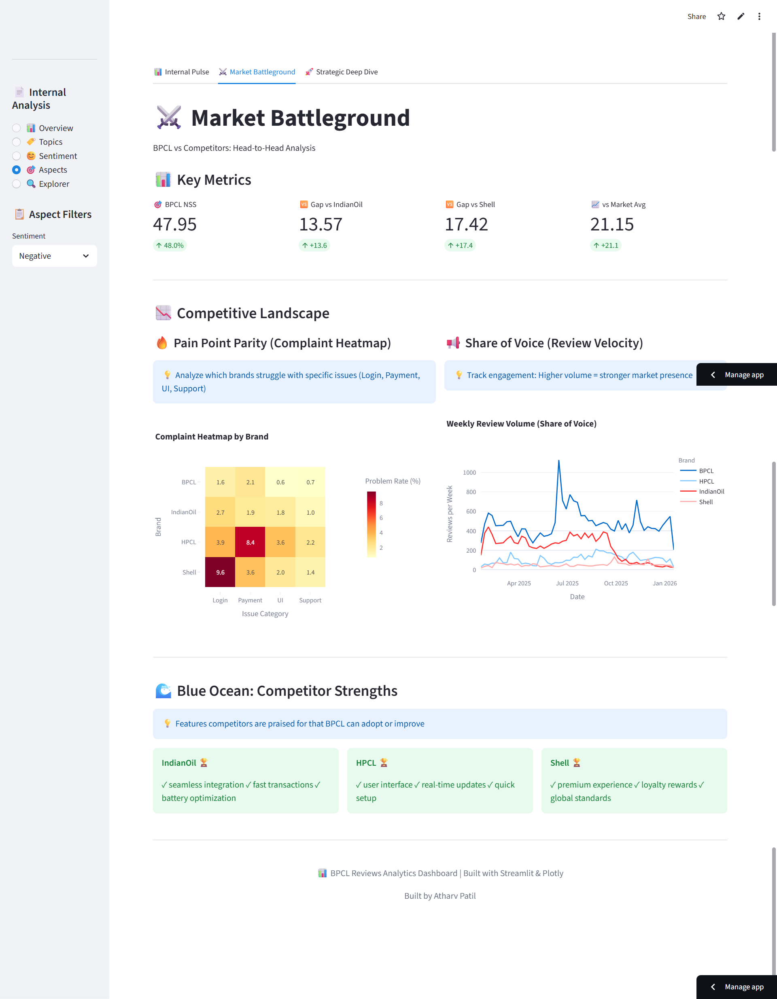
*Figure C.5: Market Battleground Tab (Competitive Analysis)*

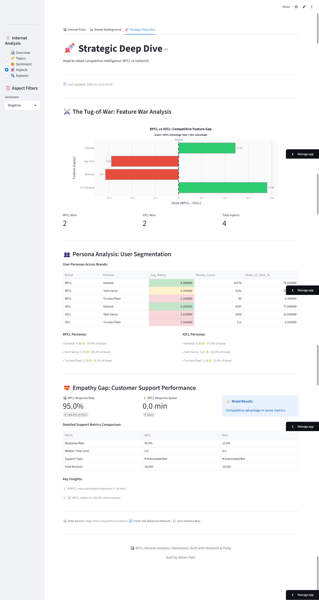
*Figure C.6: Strategic Deep Dive Tab (Feature War)*

### Appendix D: Code Repository Structure

```
Voc_Bpcl2/
├── 02_sentiment_analysis.ipynb    # Sentiment model training (VADER + BERT)
├── topic_modeling.ipynb           # LDA topic discovery
├── ABSA.ipynb                     # Aspect-Based Sentiment Analysis (PyABSA)
├── 04_Competitive_Benchmarking_VoC.ipynb  # Competitive analysis
├── 03_dashboard.py                # Streamlit analytics app (3 tabs)
├── deep_dive_renderer.py          # Strategic deep dive visualizations
├── df_final_enriched.csv          # Processed dataset with sentiment/topics
├── HelloBPCL_Detailed_Analysis.csv # ABSA output (37,124 aspect-sentiment pairs)
├── confusion_matrix_data.json     # Model performance metrics
├── topic_keywords.json            # Topic-keyword mappings
├── requirements.txt               # Python dependencies
├── lda_models.pkl                 # Saved LDA models
├── review_data.pkl                # Cached review data
└── data/
    ├── competitive_master_report.json  # Competitive benchmarking results
    └── empathy_metrics_final.csv       # Support response metrics
```

### Appendix E: Dashboard Tab Structure

```
📊 BPCL Reviews Analytics Dashboard
│
├── 📊 Internal Pulse (Tab 1)
│   ├── Overview       → KPIs, Sentiment Gauge, Trends
│   ├── Topics         → LDA Topic Analysis
│   ├── Sentiment      → Violin Plots, Distributions
│   ├── Aspects        → ABSA Drill-Down (PyABSA)
│   └── Explorer       → Search & Filter Reviews
│
├── ⚔️ Market Battleground (Tab 2)
│   ├── NSS Metrics    → Net Sentiment Scores
│   ├── Gap Analysis   → Competitor Gaps
│   ├── Pain Point Parity → Complaint Heatmap
│   ├── Share of Voice → Review Volume Trends
│   └── Blue Ocean     → Competitor Strengths
│
└── 🚀 Strategic Deep Dive (Tab 3)
    ├── Feature War    → Tug-of-War Chart
    ├── Persona Analysis → Customer Segments
    └── Empathy Gap    → Support Metrics
```

---

**End of Report**

---

*Report generated as part of the Voice of Customer (VoC) Analysis Internship Project for BPCL.*
